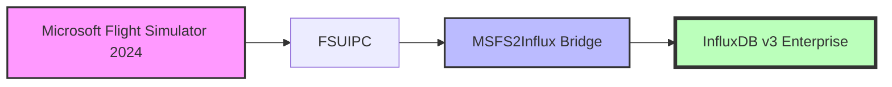

# InfluxDB v3 Enterprise Demo Integration

This guide demonstrates how to use [MSFS2Influx](https://github.com/influx-demo/msfs2influxdb3-enterprise) with InfluxDB v3 Enterprise to collect and store flight simulator data. This repo contains the visualizations.

## Overview

The demo setup consists of:

1. **InfluxDB 3 Enterprise (v3.2)**: Time series database for flight data
2. **Node.js**: Run-time environment for this demo
3. **This demo**: Real-time visual dashboard
4. **MSFS2Influx**: Get data from FlightSim to InfluxDB

### MSFS2Influx



## Setting Up InfluxDB

This demo requires a self-hosted InfluxDB v3 Enterprise instance.

1. Download [InfluxDB v3 Enterprise v3.2 for Windows AMD64 x86_64](https://dl.influxdata.com/influxdb/releases/influxdb3-enterprise-3.2.0-windows_amd64.zip)

   > 🍏 🐧 This repo assumes the demo is running on a Windows mcahine, but if you want to get it working on another platform, you can download v3.2 for [macOS Silicon ARM64](https://dl.influxdata.com/influxdb/releases/influxdb3-enterprise-3.2.0_darwin_arm64.tar.gz), [Linux AMD64 x86_64](https://dl.influxdata.com/influxdb/releases/influxdb3-enterprise-3.2.0_linux_amd64.tar.gz), and [Linux ARM64 AArch64](https://dl.influxdata.com/influxdb/releases/influxdb3-enterprise-3.2.0_linux_amd64.tar.gz)). Other versions of InfluxDB 3 Enterprise might also work but haven't been tested.

2. Extract the ZIP file to `C:\Program Files\InfluxData\influxdb`

3. Start InfluxDB by running [`./scripts/1-start-influxdb.bat`].(/scripts/1-start-influxdb.bat) in this repo.

   > ℹ️ The first time you run this, you'll be asked to select a license type. Choose (1) FREE TRIAL, enter your email address, and wait for the verification email. After verifying, the command line process will complete, and InfluxDB3 will attempt to run. You might need to allow firewall access. If you might want to run the MSFS Bridge on a separate machine, tick the "Private networks, such as my home or work network" too. 

## Setting up this demo

1. [Install Node.js](https://nodejs.org/en/download/)

2. Run [`./install.ps1`](./install.ps1) while InfluxDB is running. This will:
    - generate an admin token
    - create a `flightsim` bucket
    - create a bucket token with read and write privileges
    - create the `config.json` in the repo root

3. Run [`./scripts/2-start-demo.bat`](./scripts/2-start-demo.bat) to start the demo.

   > ℹ️ The demo is running when you see the following message:
   >  ```
   >    - Local:        http://localhost:3000
   >    - Network:      http://192.168.4.238:3000
   >
   >  ✓ Starting...
   >  ✓ Ready in 2.2s (or some other number)
   >  ```

4. Open the **Local:** link in your browser

   NOTE: typically http://localhost:3000 for Next.js projects, but if it's in use it will find the next available port number and you'll see something like this instead:

   > ```
   >  ⚠ Port 3000 is in use, using available port 3001 instead.
   >    ▲ Next.js 15.3.1
   >    - Local:        http://localhost:3001
   >    - Network:      http://192.168.4.238:3001
   > 
   >  ✓ Starting...
   >  ✓ Ready in 2.4s
   > ```

5. You'll then see a list of the buckets in your InfluxDB instance. Create a new bucket named "flightsim".

6. Click on the `</>` icon to see the API token for the bucket.

## Database Size

Currently, to get database size showing, you'll need to edit `config.json` in the repo root manually to add the `dataPath` as a top-level property:

```json
{
  ...
  "dataPath": "C:\\Users\\yourname\\influxdb_data\\flightsim",
  ...
}
```

> 💡 Your data path is created by InfluxDB when you first start it above, and can be generated by running the following in a PowerShell window:

```powershell
echo $([Environment]::GetFolderPath("UserProfile") + "\influxdb_data\")
```

> ℹ️ Note: that this file won't exist until after you've completed the setup wizard mentioned in the Setup section.

## Congratulations!

You now have the demo running and reading data from InfluxDB.

Next, you'll need to install [MSFS2Influx](https://github.com/influx-demo/msfs2influxdb3-enterprise) to collect data from your simulator and publish it to InfluxDB. The Bucket name and API token you copied in step 10 will be needed.
